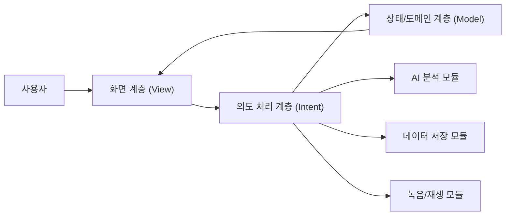
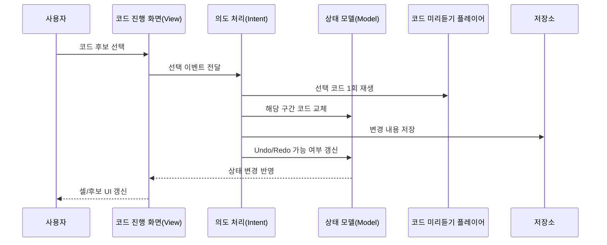
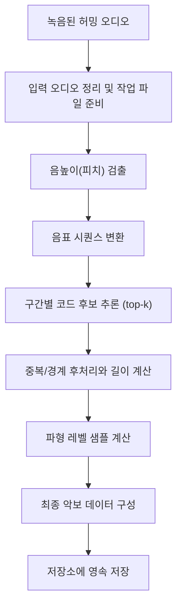
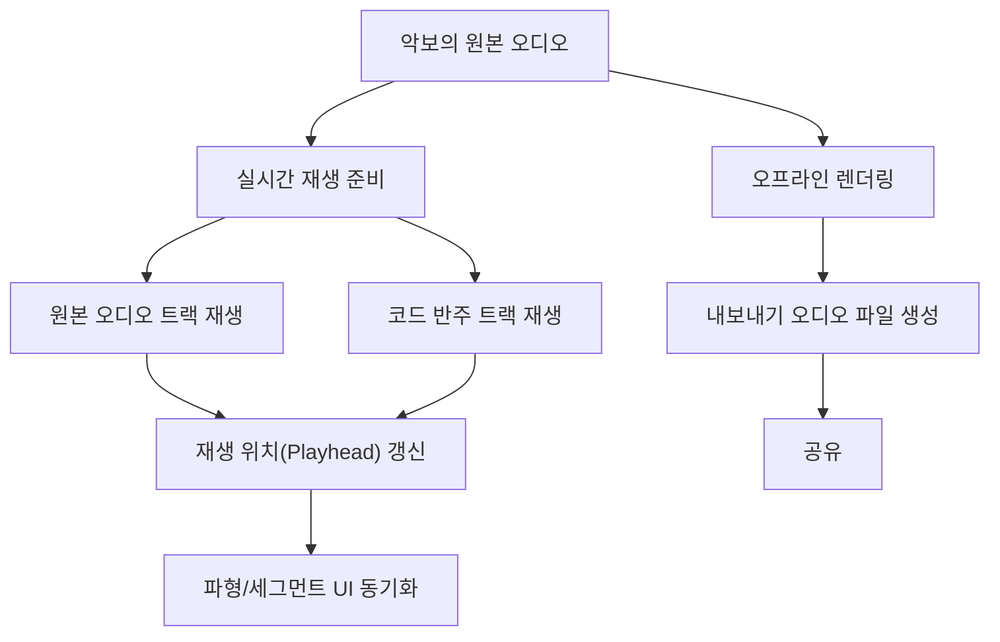

## 배포
👉 [iOS 앱 스토어](https://apps.apple.com/kr/app/re-chord-%EC%9E%91%EA%B3%A1%EC%9D%98-%EC%8B%9C%EC%9E%91/id6754222735?l=en-GB)

## 2. 프로젝트 소개
Re:Chord는 사용자가 허밍한 멜로디를 바탕으로 코드 진행을 자동으로 추천하고, 세그먼트 단위로 빠르게 편집해 완성된 결과를 공유할 수 있게 돕는 코드 추천 앱입니다. 악기 연주에 익숙하지 않은 사용자도 음성 입력만으로 초안을 만들고, 후보 코드를 비교하면서 원하는 분위기의 진행으로 다듬을 수 있습니다.

앱은 MVI 구조를 기반으로 화면 상태를 일관되게 관리하고, 피치 검출과 Core ML 추론을 결합해 코드 후보를 생성합니다. 생성된 결과는 파형 기반 편집 UI, 운지법 확인, 악보/오디오 내보내기까지 자연스럽게 이어지도록 설계되어 있습니다.

## 3. 개발 환경
| 구분 | 내용 |
| --- | --- |
| 언어 | Swift 5.0 |
| UI | SwiftUI (일부 UIKit 연동) |
| 아키텍처 | MVI (View-Intent-Model) |
| AI/분석 | SwiftF0, Core ML (TransformerChordInference) |
| 데이터 저장 | SwiftData |
| 오디오 처리 | AVFoundation |
| 반응형 상태 처리 | Combine |
| 타깃 환경 | iOS 18.0+ |

## 4. Architecture

### 4.1 전체 시스템 구성도
사용자 입력이 의도 처리 계층을 거쳐 상태를 바꾸고, 다시 화면에 반영되는 핵심 순환 구조를 먼저 보여줍니다.

기술 포인트:
1. 복잡한 내부 타입은 상위 모듈로 묶어서 표현합니다.
2. 상세 구현은 4.2~4.4에서 단계적으로 설명합니다.
3. 첫 다이어그램은 전체 흐름을 빠르게 이해하는 데 집중합니다.

### 4.2 MVI 상호작용 다이어그램
코드 후보를 선택했을 때 입력 이벤트가 상태 변경과 저장, 화면 반영으로 이어지는 흐름을 설명합니다.

기술 포인트:
1. Intent는 사용자 이벤트를 받아 모델 변경과 부수 효과(미리듣기/저장)를 조율합니다.
2. Model은 편집 상태, 선택 셀, Undo/Redo 가능 여부를 단일 상태로 관리합니다.
3. View는 모델 상태만 구독해 재렌더링하므로 UI 갱신 경로가 단순합니다.

### 4.3 Core ML 추론 파이프라인
허밍 입력이 코드 진행 데이터로 변환되는 과정을 역할 중심으로 설명합니다.

기술 포인트:
1. 먼저 녹음 파일을 앱 작업 영역으로 옮겨 이후 분석 단계를 안정적으로 수행합니다.
2. 피치 검출 결과를 음표 시퀀스로 바꾼 뒤, 구간별 코드 후보를 상위 확률(top-k) 기준으로 생성합니다.
3. 코드 경계와 길이를 정리하고 파형 레벨을 함께 계산해 편집 가능한 최종 악보 데이터로 저장합니다.

코드 매핑 (참고):
| 역할 | 코드 식별자 |
| --- | --- |
| 입력 오디오 정리/오케스트레이션 | `ScoreFactory.createScore` |
| 음높이 검출 | `SwiftF0Detector.detect` |
| 음표 변환 | `NoteConverter.convert` |
| 코드 추론 | `ChordInferencer.inference` |
| 후처리 | `mergeConsecutive` / `alignFirstStartTimeToZero` / `calculateDuration` |
| 레벨 추출 | `AudioLevelMeter.calculateLevel` |

### 4.4 Audio 파이프라인 (재생 + 내보내기)
실시간 재생 경로와 오프라인 내보내기 경로를 분리해 오디오 처리 책임을 설명합니다.

기술 포인트:
1. 재생 중에는 원본 오디오와 코드 반주를 동기화해 하나의 재생 위치 기준으로 UI를 업데이트합니다.
2. 내보내기에서는 오프라인 렌더링을 통해 공유 가능한 단일 오디오 파일을 생성합니다.
3. 재생 경로와 내보내기 경로를 분리해 사용자 경험과 결과물 품질을 동시에 확보합니다.

### 4.5 다이어그램 표기 규칙
1. 각 다이어그램 위에는 1문장 요약, 아래에는 기술 포인트 2~3줄을 둡니다.
2. 박스 이름은 한국어 역할명을 기본으로 사용합니다.
3. 코드 타입/메서드명은 괄호 또는 코드 매핑 표에서만 보조 표기합니다.
4. 4.1은 구조 이해용으로 유지하고, 세부 타입은 4.2~4.4에서만 노출합니다.

## 5. 주요 기능

### 5.1 허밍 녹음

- 페이지 설명: 사용자는 카운트다운 후 바로 허밍을 녹음하고, 녹음 상태를 직관적으로 확인할 수 있습니다.
- 기술 포인트:
1. 녹음 권한 처리와 상태 전환을 Intent에서 일관되게 제어합니다.
2. 녹음 중 레벨 샘플을 주기적으로 수집해 시각 피드백에 활용합니다.
3. 녹음 완료 후 다음 분석 단계로 자연스럽게 연결됩니다.

### 5.2 AI 코드 추론

  
- 페이지 설명: 허밍 오디오를 바탕으로 조성 및 코드 진행 후보를 자동 생성해 초안을 빠르게 만듭니다.
- 기술 포인트:
1. 피치 검출과 음표 시퀀스 변환으로 ML 입력 품질을 확보합니다.
2. Transformer 기반 추론으로 구간별 코드 후보(top-k)를 생성합니다.
3. 후처리로 코드 경계와 길이를 정리해 편집 가능한 형태로 제공합니다.

### 5.3 코드 편집

  
- 페이지 설명: 사용자는 5초 단위 세그먼트 화면에서 코드를 수정하고 편곡을 다듬을 수 있습니다.
- 기술 포인트:
1. 파형 탭/드래그로 원하는 시점으로 즉시 이동해 세밀한 편집이 가능합니다.
2. 후보 코드를 선택하면 해당 코드만 즉시 1회 미리듣기로 재생됩니다.
3. 코드 변경 이력은 Undo/Redo 스택으로 관리해 반복 수정에 대응합니다.

### 5.4 코드 시트/오디오 내보내기

- 페이지 설명: 완성된 결과를 코드 시트 이미지와 오디오 파일로 내보내고 공유할 수 있습니다.
- 기술 포인트:
1. 코드 시트를 이미지로 렌더링해 빠르게 공유 가능한 형태로 제공합니다.
2. 오프라인 렌더링으로 내보내기용 오디오 파일을 생성합니다.
3. 공유 액션을 통해 결과물을 외부 앱으로 전달할 수 있습니다.
